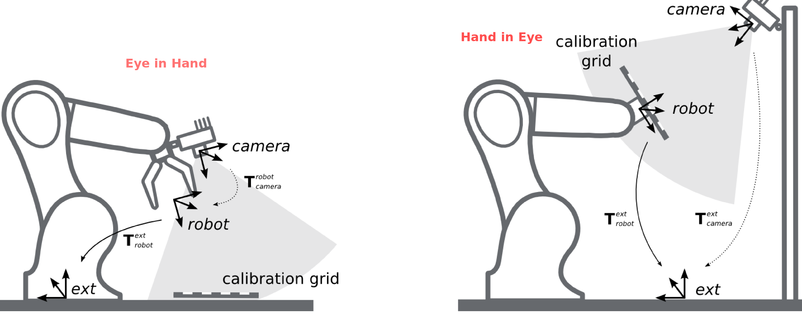

## Aim
This repository conbtains ROS packages, which are to be used to calibrate;
* extrinsics,  Hand-in-Eye or Eye-in-Hand.   
* intrinsics,  parameters of a 2D camera. 

## Problem Statement for Hand-Eye or Eye-in-Hand calibration
The camera can be either; 
* attached to Robot's End-effector (Eye in Hand) 
* fixed to a certain postion with respect to Robots base frame (Hand in Eye)

In first case we try to find the rigid body transfrom matrix that would transform a 6DOF pose in camera frame to End-Effector frame (Eye in Hand). While in second case we try to find the rigid body transfrom matrix that would transform a 6DOF pose in camera frame to Robot Base frame (Hand in Eye).
A depiction of this two cases can be seen in the following figure;

In order for find 