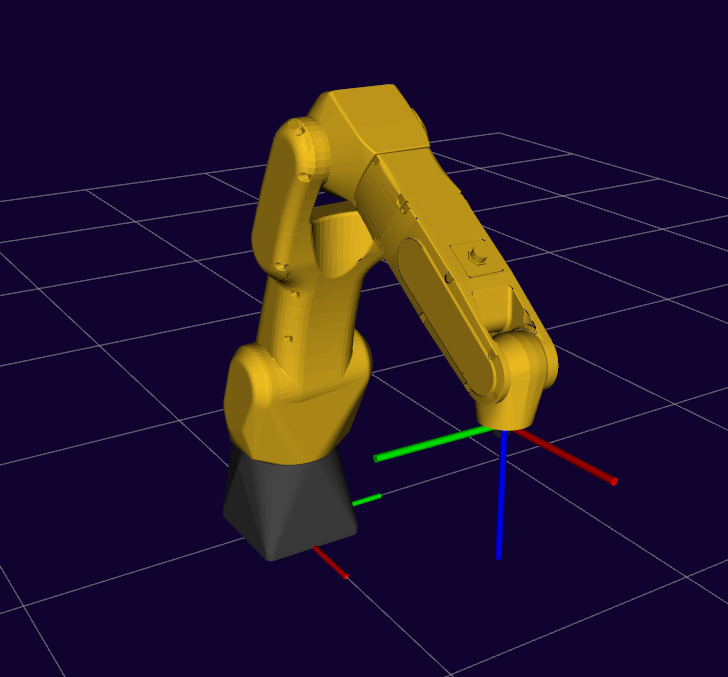
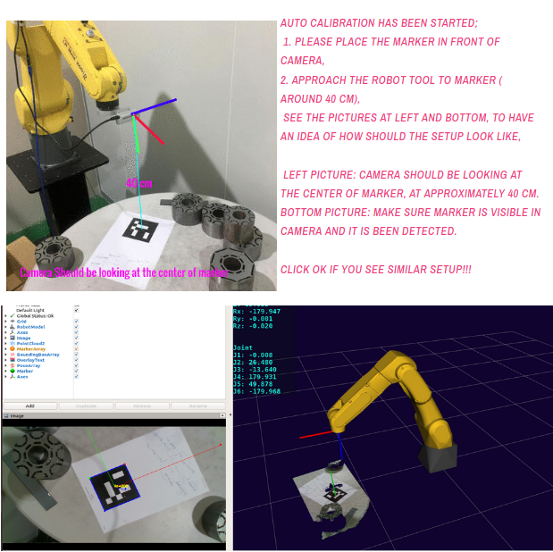
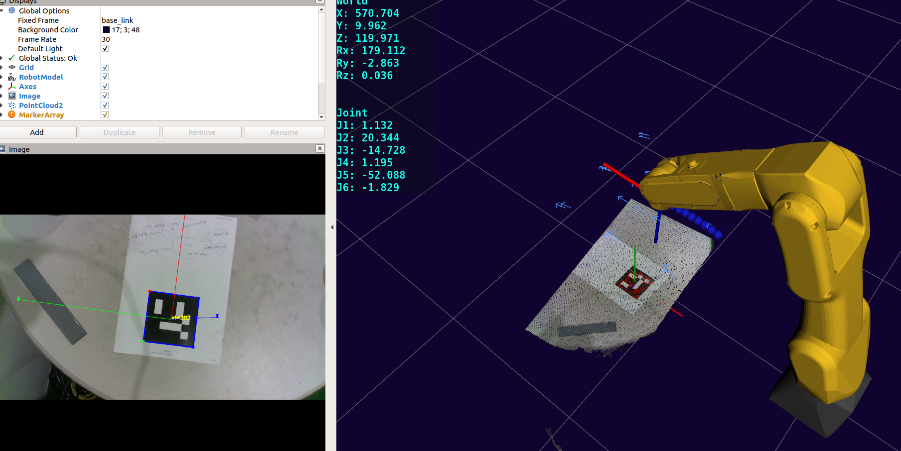
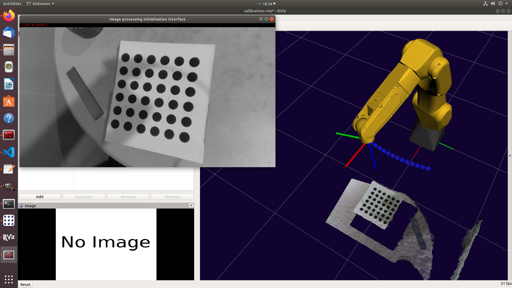

# Table of Contents
- [Prerequisites](#prerequisites)
- [Installation](#installation)
    + [ROS Melodic](#ros-melodic)
    + [MoveIt](#moveit)
    + [QT5 Default](#qt5-default)
    + [vision_visp](#vision-visp)
    + [visp](#visp)
    + [Aruco](#aruco)
    + [ros_calib](#ros-calib)
    + [Build anmd Source](#build-anmd-source)
- [Aim](#aim)
- [Problem Statement for Hand-Eye or Eye-in-Hand calibration](#problem-statement-for-hand-eye-or-eye-in-hand-calibration)
- [handeye_calib](#handeye-calib)
  * [Aruco Tracker for handeye_calib](#aruco-tracker-for-handeye-calib)
  * [Type of Camera that You use for handeye_calib](#type-of-camera-that-you-use-for-handeye-calib)
  * [Running the handeye_calib](#running-the-handeye-calib)
- [cam_calib](#cam-calib)
  * [Type of Camera that You use for cam_calib](#type-of-camera-that-you-use-for-cam-calib)
  * [Running the cam_calib](#running-the-cam-calib)
- [common lib and its utilities](#common-lib-and-its-utilities)

This stack involves with 3 types of calibrations that are crucial when working with a camera and robotic arm. 
To describe this 3 types we can ask following questions;

1. Given a camera and a calibration board find camera intrinsic parameters(cam_calib).

2. Given a camera attached to robotc arm's end-effector, Find transform between end-effector link and camera link(haneye_calib).

3. Given a camera located at a static pose WRT robot base link , Find transform between base link and camera link(handeye_calib).

You will notice that in 2nd and 3rd questions they both point to  haneye_calib. haneye_calib package is capable to perform these boh types of calibration namely , the 2nd question is interpretted as (eye_in_hand) and 3rd question is interpretted as eye_in_base.
This setting is configureable and cn be found under yaml file of haneye_calib.

Calibrations can be performed in both simulation and real robots. See the gif below for illustration of handeye_calibration


## Prerequisites
```cpp

* ROS Melodic
* Moveit (Binary Install);
* QT5 Default from Ubuntu apt-get
* vision_visp
* visp
* Aruco Tracker for handeye_calib
* YOUR CAMERA'S ROS PACKAGE

```
## Installation
#### ROS Melodic
  Installation [here](http://wiki.ros.org/melodic/Installation/Ubuntu)
#### MoveIt 
``` cpp
 sudo apt-get install ros-melodic-moveit*
```
#### QT5 Default
``` bash
 sudo apt-get install build-essential
 sudo apt-get install qtcreator
 sudo apt-get install qt5-default
```
#### vision_visp
```bash
sudo apt-get install ros-melodic-vision-visp 
```
#### visp
```bash
sudo apt-get install ros-melodic-visp
```
#### Aruco
clone aruco to your catkin_ws/src
```bash
cd catkin_ws/src
git clone https://github.com/pal-robotics/aruco_ros
```

#### ros_calib
clone this repository to your workspace
```bash
cd catkin_ws/src
git clone https://github.com/jediofgever/ros_calib.git
```
#### Build and Source 
satisfy package dependencies if any 
```bash
rosdep install --from-paths src --ignore-src --rosdistro melodic
cd catkin_ws
catkin_make 
source devel/setup.bash
```
## Aim
This repository contains ROS packages, which are to be used to calibrate;
* extrinsics,  parameters of a 2D camera Hand-in-Eye or Eye-in-Hand.   
* intrinsics,  parameters of a 2D camera. 

## Problem Statement for Hand-Eye or Eye-in-Hand calibration

The camera can be either; 
* attached to Robot's End-effector (Eye in Hand) 
* fixed to a certain postion with respect to Robots base frame (Hand in Eye)

In first case we try to find the rigid body transfrom matrix that would transform a 6DOF pose in camera frame to End-Effector frame (Eye in Hand). While in second case we try to find the rigid body transfrom matrix that would transform a 6DOF pose in camera frame to Robot Base frame (Hand in Eye).
A depiction of this two cases can be seen in the following figure;


## handeye_calib

This package can be configured to find both cases mentioned above. Under the handeye_calib/cfg/config.yaml find "eye_in_hand" parameter and configure for the type of setup you use. The default value is set to true for case of eye_in_hand.

We use [MoveIt](https://moveit.ros.org/) configured 6DOF robotic arm, other parameters under the handeye_calib/cfg/config.yaml should be adjusted to your robot's MoveIt configuration, but these parameters are mostly the same for moveit configured robots. The parameters names are descriptive enough to adress their values. In the defualt setup they are as; 

## handeye_calib configuration parameters

```yaml
#self explanary parameters
robot_base_frame: "base_link"
robot_effector_frame: "link_6"
tracking_base_frame: "camera_link"
tracking_marker_frame:  "camera_marker"
#handeye_calib package will save results into this file under your home dir
calibration_path: "handeye_calibration_result.yaml"
#is camera mounted on hand or base
eye_in_hand: true
# TOTAL NUMBER OF POSES WILL BE num_random_pose_variants * 8
num_random_pose_variants: 8
#robot will go into this pose when you start calibration , change this pose to your needs
real_robot_initial_pose:  [0.590, 0.000, 0.550, 3.14, 0.00, 0.00]
#distance in z axis that robot will keep above the aruco marker
kDistanceinZ: 0.5
```

### Aruco Tracker for handeye_calib
Obviously we need a marker that we can detect its 6DOF pose and track it in camera frame. handeye_calib uses Aruco tracker for this purpose. In the launch file of handeye_calib you will find parameters configured for Aruco tracker and its ROS node call. Generate a aruco marker here; https://chev.me/arucogen/ , (care about its size in meters) after you print it to a A4. You will need to enter the aruco marker ID and its size to correct places handeye_calib.launch
Refer to Installation section for installing Aruco as a ROS package.

### configure aruco parameters in handeye_calib.launch (handeye_calib)
```xml
  <!-- IN REAL MARKER ISZE 10 cm , in simulation it is 25 cm-->
  <!-- <arg name="marker_size" value="0.10" doc="Size of the ArUco marker used, in meters" />-->
  <!-- <arg name="marker_size" value="0.25" doc="Size of the ArUco marker used, in meters" />-->


  <remap from="/camera_info" to="/camera/color/camera_info" />
  <remap from="/image" to="/camera/color/image_raw" />
  <param name="image_is_rectified" value="false" />
  <param name="marker_size" value="$(arg marker_size)" />
  <param name="marker_id" value="$(arg marker_id)" />
  <param name="reference_frame" value="camera_link" />
  <param name="camera_frame" value="camera_color_optical_frame" />
  <param name="marker_frame" value="camera_marker" />
```

### Type of Camera that You use for handeye_calib
We have used realsense d435 camera and in the launch file you will see that in the launch file of handeye_calib we start realsense camera,
but any RGB camera that can be run with ROS should be usable. Though the topic names and coordinate frames should be double checked when setting the parameters. in handeye_calib config.yaml and handeye_calib.launch files. 

Replace the Realsense part in handeye_calib.launch, if you are using another camera 

### Running the handeye_calib
For handeye_calib to run , you will need to make sure you have bringed up the robot, and a TF stream is available for the TF listener, This typically is achieved by initilizing the Moveit generated launch files for your robot , e.g move_group launch file. 



To start handeye_calib node together with rviz ,aruco and camera; 

```bash
roslaunch handeye_calib calib.launch
```

A QT popup should be displayed showing you the setup of the marker and camera as; 



Click OK if your setup is similar, After pressing ok The handeye_calib will generate around 50 random poses around the marker and these poses will be executed respectively. Note that this random poses will not approach the marker(z direction) , random poses will vary only in x-y plane and they are symetrical. 



At Left you will be able to see the resulting aruco marker detection for debugging purposes. 

on The right side; The Arrows surronding the Robot end-effector, are actually 6DOF poses randomly generated by the utility class in "common" library provided by ros_calib, the robot will plan to each of this poses and take a sample for the calibration. The blue line is current planned path. PointCloud is only for visualization puposes, it is not needed to perform this calibration.

Note that this process is fully automatic and once started it does not need any more interaction with the user.

After after each pose the calibration will be calculated and a .yaml file will be dumped to calibration_path that you set in config.yaml file

## cam_calib

This package can be used to calibrate intrinsics of camera. Again this package is based on vision_visp, a marker that consists of circles is used,  
the marker can be found [here]( https://github.com/lagadic/vision_visp/blob/master/visp_camera_calibration/launch/images/grid2d.pdf)

Print the marker in 1:1 scale, measure to make sure the linear distance between center of ircles is 30mm. The marker should be on a flat and rigid surface to avoid distortions. 

### Type of Camera that You use for cam_calib
Again we tested cam_calib with realsense d435 camera but it is no big deal to use another camera as long as you make it run with ROS. In the ros_calib/cam_calib/cfg/config.yaml file change/check that topic names are matching to your camera's; 

for example in realsense following topics are used;

## configuration parameters for cam_calib
```yaml
# camera image topic name , RGB image
camera_image_topic_name: "/camera/color/image_raw"
# ros service topic name to set camera info,
set_camera_info_service_topic_name: "/camera/color/set_camera_info"
# calibration file name under your /home/user_name/calibration_path
calibration_path: "cam_calibration_result.ini"
#DO NOT CHANGE THE VALUES,
gray_level_precision: 0.7
size_precision: 0.5
pause_at_each_frame: True
# BE SURE THAT PRINTED MARKER CIRCLES HAVE 30MM linear distance between each other
# refer to https://github.com/lagadic/vision_visp/tree/master/visp_camera_calibration/launch for details
model_points_x: [0.0, 0.03, 0.06, 0.09, 0.12, 0.15, 0.0, 0.03, 0.06, 0.09, 0.12, 0.15, 0.0, 0.03, 0.06, 0.09, 0.12, 0.15, 0.0, 0.03, 0.06, 0.09, 0.12, 0.15, 0.0, 0.03, 0.06, 0.09, 0.12, 0.15, 0.0, 0.03, 0.06, 0.09, 0.12, 0.15]
model_points_y: [0.0, 0.00, 0.00, 0.00, 0.00, 0.00, .03, 0.03, 0.03, 0.03, 0.03, 0.03, 0.06, 0.06, 0.06, 0.06, 0.06, 0.06, 0.09, 0.09, 0.09, 0.09, 0.09, 0.09, 0.12,0.12, 0.12, 0.12, 0.12, 0.12, 0.15,0.15, 0.15, 0.15, 0.15, 0.15]
model_points_z: [0.0, 0.00, 0.00, 0.00, 0.00, 0.00, 0.0, 0.00, 0.00, 0.00, 0.00, 0.00, 0.0, 0.00, 0.00, 0.00, 0.00, 0.00, 0.0, 0.00, 0.00, 0.00, 0.00, 0.00, 0.00, 0.00, 0.00, 0.00, 0.00, 0.00, 0.0, 0.00, 0.00, 0.00, 0.00,0.00]
selected_points_x: [0.03, 0.03, 0.09, 0.12]
selected_points_y: [0.03, 0.12, 0.12, 0.03]
selected_points_z: [0.00, 0.00, 0.00, 0.00]
# TOTAL NUMBER OF RANDOM POSES WILL BE num_random_pose_variants * 10
num_random_pose_variants: 4
kDistanceinZ: 0.5
real_robot_initial_pose:  [0.300, -0.040, 0.670, 3.14, 0.00, 0.00]
```

### Running the cam_calib
Just like handeye_calib , once we run this package a set of randomly generated poses be queued, after arriving at each pose the user will be asked to select the keypoints 1-2-3-4 on the image. After selected all keypoints the algorithm should be able to find the rest of other circles, the user should click mouse-left and the robot will be moved to next pose, this process will take place until all generated poses are visited, finally a .ini file will dumped to calibraion_path that you set in cfg/config.yaml file. 

At Each pose the shot will be taken and the user will be asked to click on center of keypoints 1-2-3-4. 
click on the center of key points after selected all 4 points  click left to go to next pose


the remaining circles will uatomaically be detected by VISP.


NOTE; Sometimes due to bad lighting or bad pose, some of circles will be missed or will not be detcted at all , in this cases a QT message will be shown and user will be informed. The result of such cases will not be included into calibration , the robot will move onto next pose

## common lib and its utilities

If you read until here carefully you might have noticed there is some magical things going on , such as random generated poses, planning to this poses, plan execution etc. 

This functionalities are provided by common lib, RandomPoseGenerator class of common lib is responsible to generate random poses surronding robot end-effector, this poses cannot be further than 20 cm. RobotController class is responsible to make a plan and move robot along the planned path. A visualization of plan in blue color is shown in RVIZ at each plan execution.


## Referencess
[1] http://wiki.ros.org/vision_visp

[2] https://github.com/IFL-CAMP/easy_handeye
